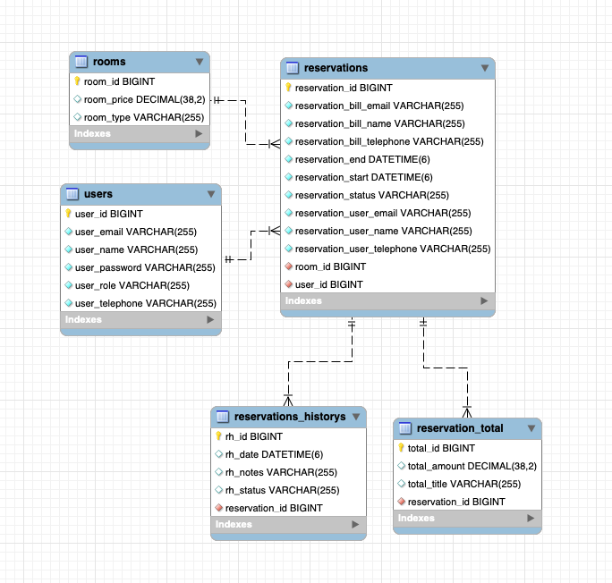

# 📘 HotelApi - Documentación Técnica

## 📖 Descripción General

**HotelApi** es una API RESTful desarrollada en Java con Spring Boot para la gestión de reservas de habitaciones de hotel. La aplicación permite registrar usuarios (personal del hotel), crear y consultar reservas, llevar un historial de cambios y calcular los montos totales de las reservas. La lógica está orientada a mantener una arquitectura limpia, con uso extensivo de DTOs, mapeadores y buenas prácticas de diseño.

---

## 🧰 Tecnologías Usadas

| Tecnología       | Rol                                                        |
|------------------|-------------------------------------------------------------|
| Java             | Lenguaje principal                                          |
| Spring Boot      | Framework para el desarrollo backend                        |
| Spring Data JPA  | Gestión de persistencia de datos con repositorios JPA       |
| H2 / MySQL       | Base de datos (dependiendo del entorno)                     |
| Lombok           | Eliminación de boilerplate (getters/setters, etc.)          |
| MapStruct        | Generación automática de mapeadores entre entidades y DTOs  |
| Maven            | Gestión de dependencias                                     |
| JUnit / Mockito  | Pruebas (no se detallan aún en este resumen)               |
| Swagger (opcional) | Documentación de la API si se incluye en la práctica     |

---

## 📊 Modelo de Datos

El sistema gestiona entidades como:
- **Users**: Usuarios registrados.
- **Rooms**: Habitaciones disponibles.
- **Reservations**: Reservas realizadas.
- **ReservationsHistorys**: Historial de cambios en reservas.
- **ReservationTotal**: Totales asociados a cada reserva.




## 🏗️ Estructura del Proyecto

```text
com.ejemplo.hotelapi
├── Controller
│   ├── HistorialController.java
│   ├── ReservationController.java
│   ├── RoomController.java
│   ├── TotalController.java
│   └── UserController.java
├── Dto
│   ├── Reservation, Room, User, Total, Historial
├── Entity
│   ├── Reservation, ReservationHistory, ReservationTotal, Room, User
├── Exception
│   ├── ExDataNotFoundException, GlobalExceptionHandler
├── Mapper
│   ├── MapStruct interfaces para Room, User, Reservation, etc.
├── Repository
│   ├── Interfaces JPA: IRoomRepo, IUserRepo, IReservationRepo, etc.
├── Service
│   ├── Interfaces y sus implementaciones
├── Response
│   ├── ResponseDTO, ResponseMessage, PageResponseDTO
└── HotelApiApplication.java
```

---

## 🧩 Componentes Clave

### 📦 Entidades
- `User`: Representa a trabajadores del hotel.
- `Room`: Datos de las habitaciones.
- `Reservation`: Detalles de reservas con historial y total asociados.
- `ReservationHistory`: Cambios de estado de una reserva.
- `ReservationTotal`: Costos calculados automáticamente.

### 📥 DTOs y Mappers
El proyecto hace un uso adecuado de DTOs para separar el modelo de dominio de la capa de presentación. Todos los mappers son generados con **MapStruct**.

### ⚙️ Servicios
Cada módulo (habitaciones, usuarios, reservas, etc.) cuenta con una interfaz de servicio y su correspondiente implementación.

### 📋 Controladores REST
Se manejan rutas RESTful claras:
- `/api/user`, `/api/room`, `/api/reserva`, etc.
- Soporte completo para operaciones CRUD.

---

## ✅ Buenas Prácticas Observadas

- Separación de responsabilidades (Controller, Service, Repository).
- Uso de DTOs para entradas/salidas de datos.
- Manejo de errores con excepciones personalizadas.
- Implementación clara y limpia en los servicios.

---


## 📝 Recomendaciones

- Agregar pruebas unitarias e integración.
- Implementar autenticación (JWT o Basic Auth).
- Considerar Swagger para la documentación de endpoints.
- Externalizar mensajes de error (i18n).

---
## 🚀 Cómo ejecutar

```bash
# Clonar el repositorio
git clone https://github.com/usuario/rentapi.git
cd rentapi

# Compilar y correr la aplicación
./mvnw spring-boot:run
